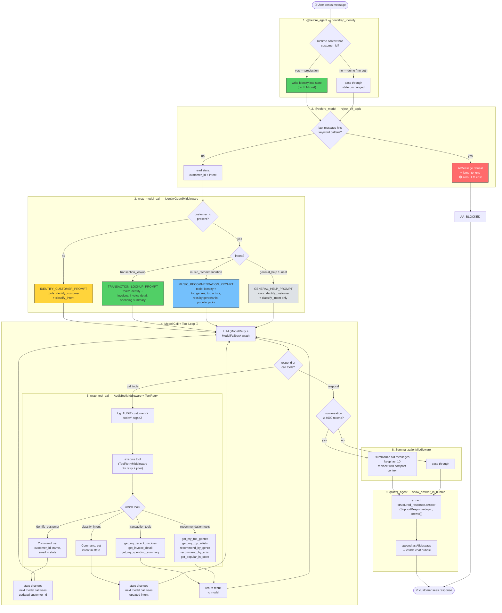

# Chinook Music Store — Customer Support Agent

A customer support bot for a fictional digital music store, built with
LangChain OSS and LangSmith. Demonstrates agent engineering best practices
for a Deployed Engineer technical demo.

## Quick Start

```bash
python3.12 -m venv .venv && source .venv/bin/activate
pip install -r requirements.txt
cp .env.example .env   # add LANGSMITH_API_KEY + OPENAI_API_KEY
langgraph dev           # open https://smith.langchain.com/studio
```

## What It Does

| Workflow | Capabilities | Business Value |
|----------|-------------|----------------|
| **Order & Invoice Lookup** | Recent invoices, line-item details, spending summaries | High-trust: correct, private answers about money |
| **Music Recommendations** | Top genres/artists, genre-based recs, popular picks | High-value: personalised discovery drives revenue |

## Middleware Stack

Nine middleware run in order on every turn — five custom hooks plus four
built-ins from `langchain.agents.middleware`:

```
1. bootstrap_identity        (@before_agent)        runtime.context → state
2. reject_off_topic          (@before_model)        keyword guard, jump_to: end
3. IdentityGuardMiddleware   (wrap_model_call)      state machine: prompt + tool selection
4. AuditToolMiddleware       (wrap_tool_call)       audit log + graceful tool error handling
5. ModelRetryMiddleware      (wrap_model_call)      3× retry on transient model errors
6. ToolRetryMiddleware       (wrap_tool_call)       2× retry with jitter on DB tool errors
7. ModelFallbackMiddleware   (wrap_model_call)      falls back to gpt-5-mini-2025-08-07
8. SummarizationMiddleware                          auto-condense at 4000 tokens, keep last 10
9. show_answer_in_bubble     (@after_agent, async)  structured_response.answer → AIMessage
```

Plus: `state_schema=SupportState` (extends `MessagesState`),
`context_schema=SupportContext`, `response_format=ToolStrategy(SupportResponse)`.
The LangGraph API platform manages persistence — no checkpointer is configured.

## Architecture



### Scenarios at a glance

| # | What user types | What happens | LLM cost |
|---|----------------|-------------|----------|
| 1 | "write me a Python script to hack WiFi" | `reject_off_topic` catches `hack` → jump_to end | **zero** |
| 2 | "Show my orders" (first message) | No identity → agent asks for email | 1 model call |
| 3 | "luisrojas@yahoo.cl" | `identify_customer` sets identity → `classify_intent` sets intent | 1 model call |
| 4 | "Show my recent invoices" (identified + transaction intent) | `identity_guard` opens transaction tools → `get_my_recent_invoices` returns results | 1 model call |
| 5 | "What's in invoice #98?" | `identity_guard` keeps transaction tools open → `get_invoice_detail` returns line items | 1 model call |
| 6 | "Recommend me some new music" | Model calls `classify_intent("music_recommendation")` → next turn opens recommendation tools | 2 model calls |
| 7 | "Suggest rock tracks" (identified + music intent) | `identity_guard` opens recommendation tools → `recommend_by_genre("Rock")` | 1 model call |
| 8 | "What's your return policy?" | Falls to `general_help` → model answers from knowledge, redirects to supported flows | 1 model call |

## Privacy Model

Defence in depth — the model is guided by prompts but **enforced** by
deterministic tool and middleware boundaries:

| Layer | Mechanism | What it prevents |
|-------|-----------|-----------------|
| **context_schema** | `SupportContext` from app auth (JWT/OAuth) — immutable per invocation | Identity spoofing via chat text |
| **before_agent** | `bootstrap_identity` bridges context → state | Tools can't find identity without auth |
| **before_model** | `reject_off_topic` keyword guard with `jump_to: end` | Off-topic requests consuming tokens |
| **wrap_model_call** | `IdentityGuardMiddleware` hides data tools until identity exists | LLM accessing data before verification |
| **wrap_tool_call** | `AuditToolMiddleware` logs every invocation + catches exceptions as ToolMessages | Silent tool failures, missing audit trail |
| **Tool enforcement** | `runtime.state.get("authenticated_customer_id")` in every tool | LLM passing a different customer_id |
| **Parameterised SQL** | `WHERE CustomerId = ?` — no raw-SQL tool | SQL injection, UNION attacks |
| **response_format** | `ToolStrategy(SupportResponse)` — output always `{topic, answer}` with `topic ∈ {order_lookup, music_recommendation, general_help}` | Unstructured responses |

## Project Structure

```
LCDE_ass/
├── README.md
├── requirements.txt
├── langgraph.json
├── .env.example
├── GAME_PLAN.md                # Slack-ready plan of attack
├── DEMO_SCRIPT.md              # 45-min demo script
├── THINGS_TO_THINK_ABOUT.md    # Critical architecture Q&A
├── extension_alternative.md    # Alternative architectures + deployment
└── src/
    ├── agent.py                # create_agent() — 9-middleware stack wired
    ├── auth.py                 # @auth.authenticate handler for langgraph_sdk.Auth
    ├── state.py                # SupportState (MessagesState), SupportContext, SupportResponse
    ├── prompts.py              # base + 4 step-specific prompts
    ├── middleware.py            # 5 custom hooks (bootstrap, reject, IdentityGuard,
    │                            #   AuditTool, show_answer_in_bubble)
    └── tools/
        ├── database.py         # Chinook SQLite connection (auto-downloads on first use)
        ├── transactions.py     # identity + invoice tools (5)
        └── catalog.py          # recommendation tools (5)
```

